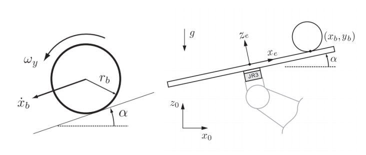
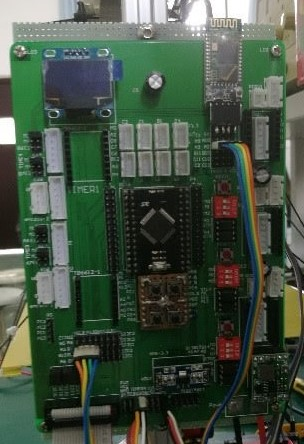
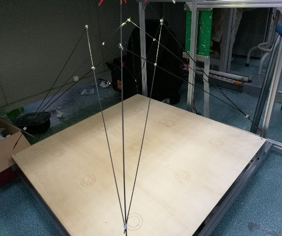
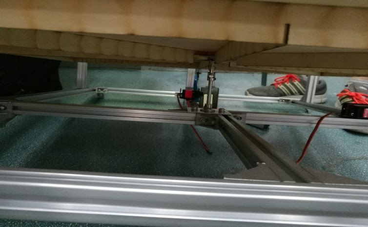
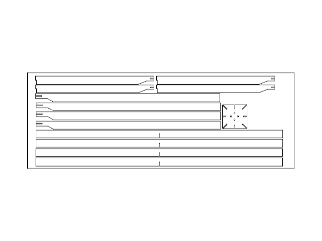
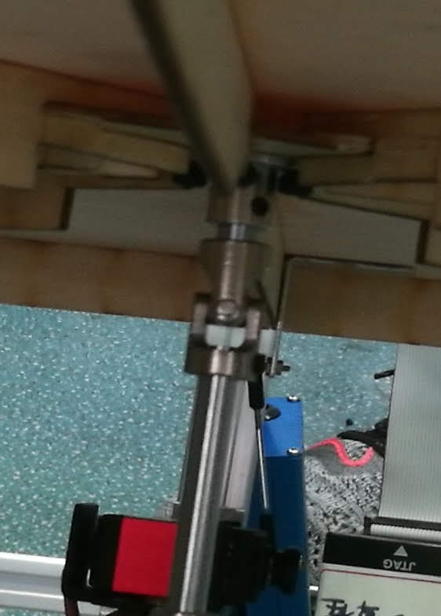
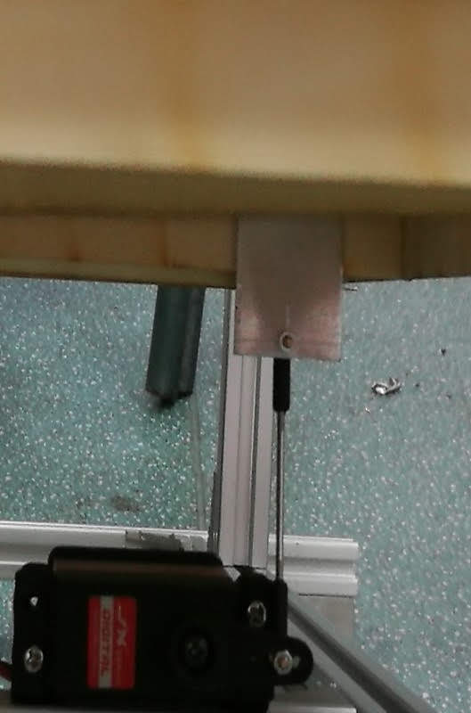
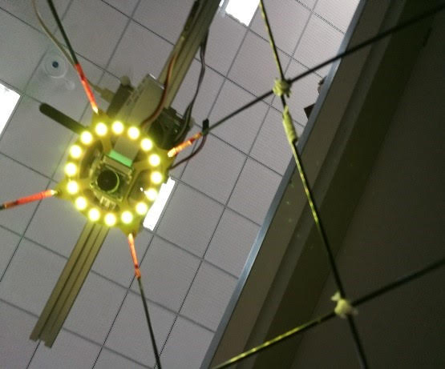
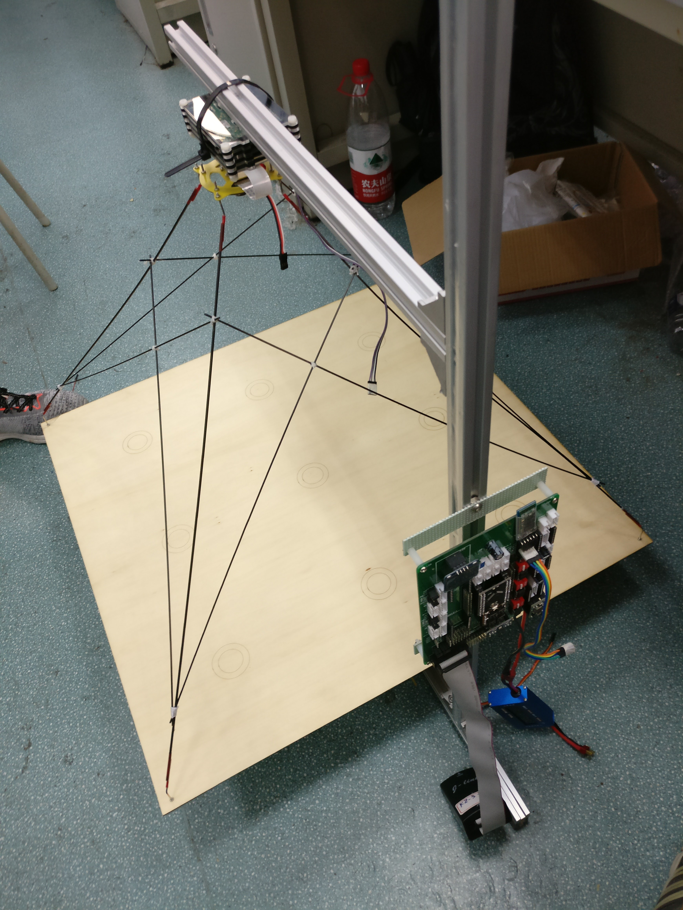
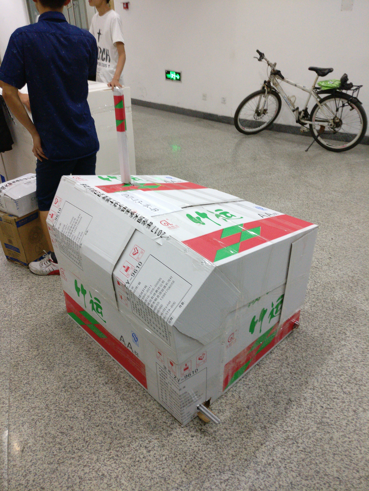

## Introduction

Ball on Big Plate project is a work of team made up with three people. We are fortunate enough to get the first prize with this in [2017NUEDC](https://www2.renesas.cn/zh-cn/about/university-program/nuedc/2017.html). 

I was responsible for building the structure and programming STM32 and Raspberry Pi. Code and document [here](https://github.com/pidan1231239/ball_on_big_plate). The other two teammates are [shicaiwei123](https://github.com/shicaiwei123) and [zianglei](https://github.com/zianglei). Sadly that [yoyolalala](https://github.com/yoyolalala) left the team before the contest. The preparation projects below can not be done without her. I'd like to thank her here.

The final work has been handed in to our school and there will be no plan to write a detailed document for it. This page tells the story behind it.

> The ball-on-plate system is a promoted version of the traditional ball-on-beam control problem. The problem consists of a plate which its deviation can be manipulated in two perpendicular directions. The goal is to carry the ball moving on the plate to a desired position, that is to control a freely rolling ball on a specific position or moving on a trajectory on the plate. - [Modelling and Control of Ball-Plate System](http://web.engr.illinois.edu/~khashab2/files/2011_LinearControl/16.pdf)
> 

Specifically in this project, according to the contest requirements, the system is supposed to move a ball between any two of nine evenly distributed circles drawn on the plate and avoids other circles. The plate must have a size around 65cm*65cm. The [document](滚球控制系统（B题）.pdf) shows the distribution of the circles.

## The Contest

[NUEDC](https://www2.renesas.cn/zh-cn/about/university-program/nuedc/2017.html) is one of the largest electronic design competitions in China. The competition last three and a half days. Four categories of more than ten subjects are published on the official website on the day it begins. Participants usually prepare for a long time before the competition. The competition in 2017 which I attended started from August 9 to August 12. Our team started preparing about four months in advance. 

I was responsible for building the structure and programming STM32 and Raspberry Pi. Although I had got some experience with programming, I barely knew the basics of control system. However, I chose the control system direction to prepare because of my interest in it.

In the preparation process, we learned from five projects, three of which are listed below.

- [Rotary Inverted Pendulum]()
- [Ball on Beam]()
- [Ball on Small Plate]()

Sadly, I've got no video demo of the final work since we were too busy moving forward. So let's jump into the details of the design.

## Platform

- Raspberry Pi Zero and Raspberry Pi 3b with OpenCV installed
- STM32F103 minimum system board
- PC with Visual Studio and VisualGDB installed

The Raspberry Pi is developed with C++ language using Raspberry toolchain provided by [VisualGDB](https://visualgdb.com/) (tutorial [here](https://visualgdb.com/tutorials/raspberry/crosscompiler/)). The STM32 is developed with C++ language using Arm toolchain provided by [VisualGDB](https://visualgdb.com/) (tutorial [here](https://visualgdb.com/tutorials/arm/stm32/)). The Raspberry runs OpenCV program and sends the results to STM32 through UART.

I made use of a C++ API written for STM32 named [ebox](https://github.com/eboxmaker/eBox_STM32F1). Although it saved me a lot of time then, I found [mbed](https://www.mbed.com/) even easier than it after the competition. By the way, it was said that Arduino is not allowed in the competition.

## Mechanical structure

The final work uses a PCB motherboard made in [Ball on Small Plate project]() to put the electronic modules together. 

The 65cm*65cm plate is made of light wood laminate board.

There are ribs below the plate to support it. The dynamic structure of the plate is same as [Ball on small plate]().

Design documents of the ribs and others are also on the [GitHub page](https://github.com/pidan1231239/ball_on_big_plate).

The camera is supported by carbon fiber tubes like in [Ball on small plate](). And the same LED circle is installed around the camera.

The Raspberry Pi 3b is hanged beyond the camera to reduce the load on the servos.

After the work was done and tested by ourselves, we packed it with cardboard then handed it over to the competition organizer.

## Final test

After a successful test in front of the judges of Sichuan division and a small test on our electronic design capabilities, we stepped into our journey to Xi'an. Here show some photos taken along the trip.

 
