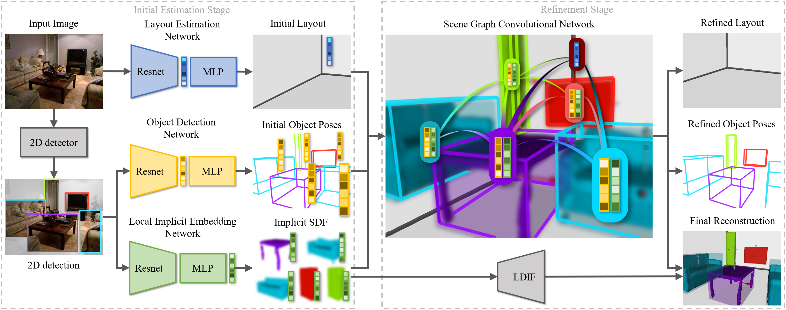
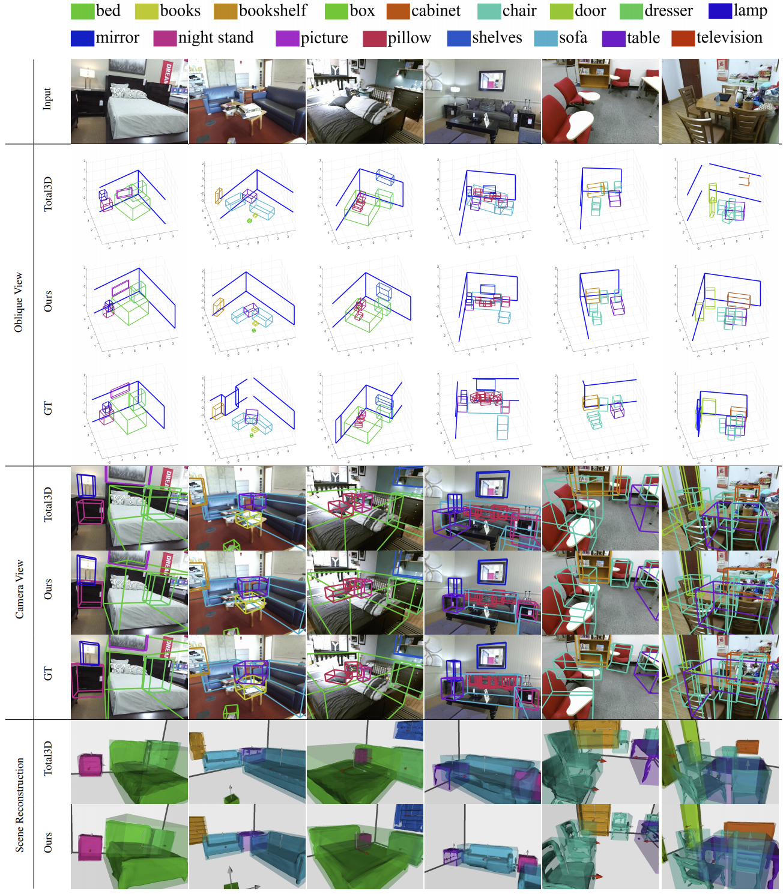

<!-- {}
Click the *Cite* button above to demo the feature to enable visitors to import publication metadata into their reference management software.
{}

{}
Create your slides in Markdown - click the *Slides* button to check out the example.
{}

Supplementary notes can be added here, including [code, math, and images](https://wowchemy.com/docs/writing-markdown-latex/). -->

## 3D Scene Understanding 
Given a single color image,
- Estimate the room layout, including object categories and poses in 3D space
- Reconstruct mesh of individual object

## Motivations
- Implicit representation like Signed Distance Function (SDF) can be used to detect collision and propagate gradients
- And together with structured representation (LDIF), the shapes can be learned better and more shape priors can be provided for relationship understanding
- Graph Convolutional Network (GCN) is proven to be good at resolving context information in the task of scene graph generation

## Pipeline

The proposed system consists of two stages, i.e., the initial estimation stage, and the refinement stage. 
In the initial estimation stage, a 2D detector is first adopted to extract the 2D bounding box from the input image, followed by an Object Detection Network (ODN) to recover the object poses as 3D bounding boxes and a new Local Implicit Embedding Network (LIEN) to extract the implicit local shape information from the image directly, which can further be decoded to infer 3D geometry.
The input image is also fed into a Layout Estimation Network (LEN) to produce a 3D layout bounding box and relative camera pose.
In the refinement stage, a novel Scene Graph Convolutional Network (SGCN) is designed to refine the initial predictions via the scene context information.

## Results

*Qualitative comparison on object detection and scene reconstruction.* We compare object detection results with Total3D and ground truth in both oblique view and camera view. The results show that our method gives more accurate bounding box estimation and with less intersection. We compare scene reconstruction results with Total3D in camera view and observe more reasonable object poses.
